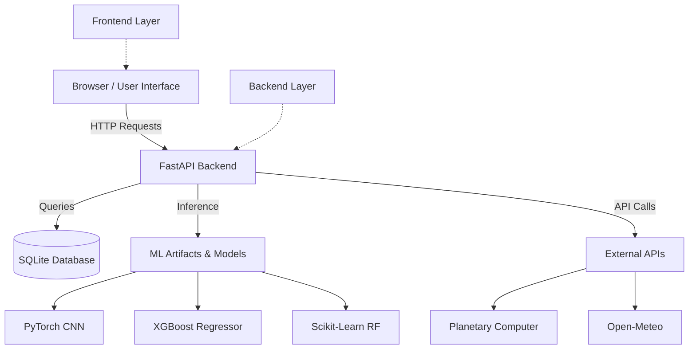
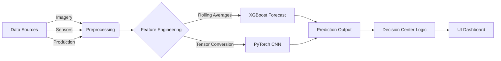
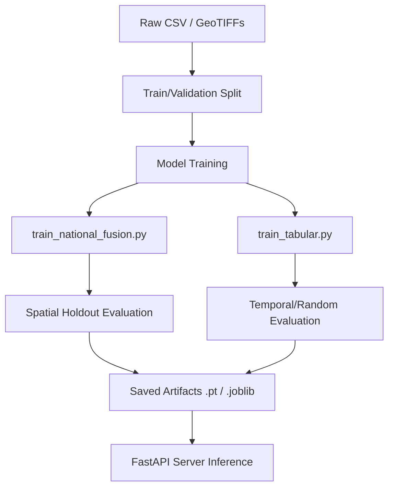

# MineOS AI Architecture

## System Architecture

The MineOS AI system is structured as a client-server web application.

## Data Flow Pipeline

## ML Training Pipeline

## Module Responsibilities

1. **`backend/server.py`**: The core FastAPI application. Handles routing, input validation (via Pydantic), and manages a thread pool for asynchronous CNN inference.
2. **`backend/planning.py`**: Contains the logic for the Decision Center, ranking alternative recovery actions based on costs.
3. **`backend/exploration.py`**: Interacts with the CNN model and the Planetary Computer API to fetch and evaluate raster imagery.
4. **`frontend/js/portal.js`**: Drives the user interface, managing state, rendering Leaflet maps, and dynamically updating UI elements based on API responses.
